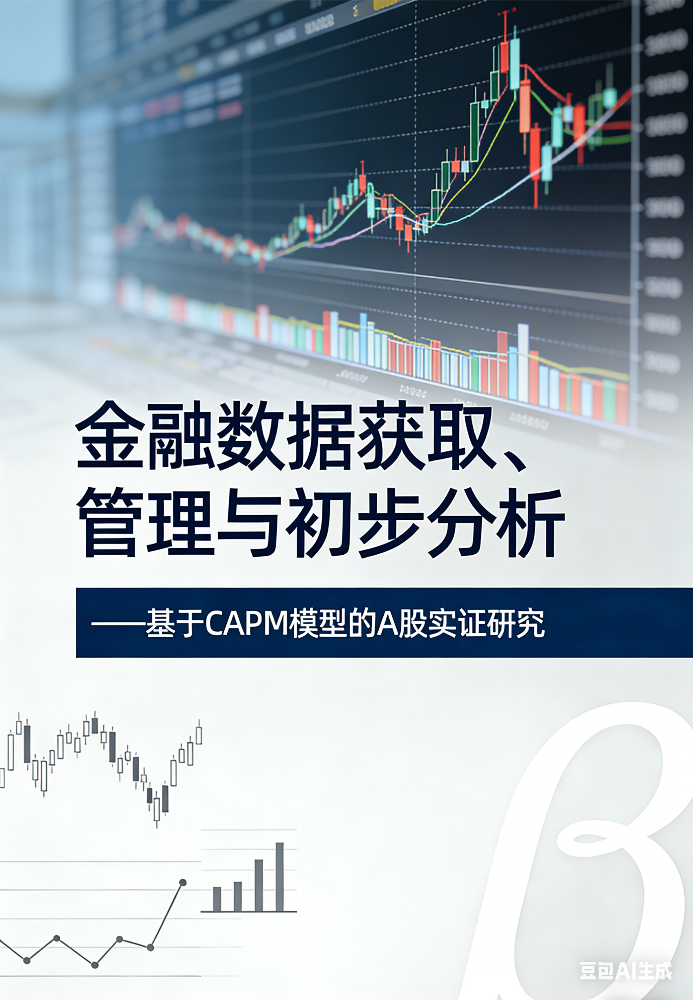

# 金融数据获取、管理与初步分析

---

## 项目概述

本研究项目系统地完成了A股金融数据的获取、清洗、存储与分析工作。我们选取了10只覆盖6个行业的代表性股票，结合宏观指标（CPI、M2），构建CAPM回归模型与CPI宏观回归模型，深入分析股票超额收益的影响因素。

## 研究背景

在现代金融理论中，CAPM（Capital Asset Pricing Model）模型是衡量资产系统性风险的核心框架。本研究基于中国A股市场实际数据，验证CAPM模型的有效性，并探索宏观因素（如通胀水平）对股票收益的解释能力。

## 主要发现

- **CAPM分析**：10只股票的系统性风险（β系数）存在明显差异，能源股（中国石油）β值最高，防御型股票（长江电力、贵州茅台）β值较低
- **CPI宏观回归**：CPI同比增速对多数股票超额收益的解释力较弱（R²多在0.01以下），其中中国石油的γ系数最为显著（γ=-0.013，p=0.075）

## 章节导航

### 第一部分：数据获取与管理

- 第一章：数据下载 - 使用baostock获取股票行情、市场指数、宏观指标
- 第二章：数据清洗 - 缺失值处理、收益率计算、数据合并
- 第三章：数据存储 - CSV与Parquet格式对比

### 第二部分：数据分析

- 第四章：描述性统计 - 各股票收益分布、相关性分析
- 第五章：CAPM回归分析 - 个股α、β系数估计
- 第六章：CPI宏观回归 - 通胀对股票收益的影响

## 技术栈

- **数据获取**：baostock（Python库）
- **数据处理**：pandas、numpy
- **统计分析**：statsmodels（OLS回归）
- **可视化**：matplotlib、seaborn
- **版本控制**：Git + GitHub
- **电子书渲染**：Quarto

## 联系作者

- GitHub仓库：https://github.com/PYC1234/dshw-p01
- 数据报告：https://PYC1234.github.io/dshw-p01/
